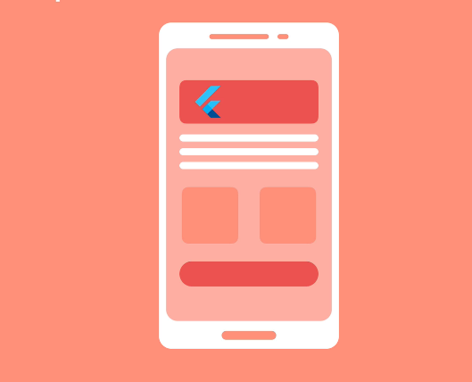
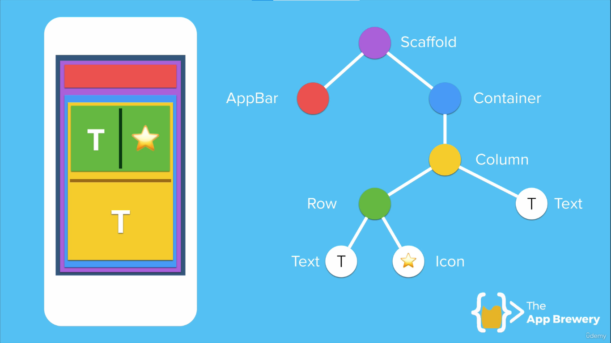
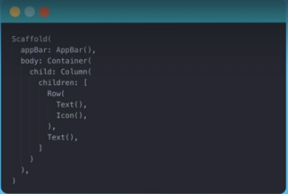

 
<h1>Estudo de Desenvolvimento   Flutter e Dart</h1>

The Complete Flutter Development BootCamp with Dart  
Officially created in collaboration with the Google Flutter team.

<h2>Módulo 1: Introdução ao desenvolvimento multiplataforma com Flutter e Dart</h2>

### Conteúdo
     
<a href="#aula01">Aula 01: O que é Flutter?</a> 
<a href="#aula02">Aula 02: Por que Flutter?</a> 
<a href="#aula03">Aula 03: A anatomia de um aplicativo Flutter</a> 

---

<h2>Aula 01: O que é Flutter?</h2>

### O que é exatamente Flutter? 

E para poder responder a essa pergunta, primeiro temos que nos colocar na mente de um desenvolvedor de aplicativos.

Imaginemos um desenvolvedor iOS.

Ele fez um aplicativo muito legal, uma espécie de Tinder mas, em vez de combinar com outras pessoas, você consegue combinar com alimentos! E você consegue descobrir qual comida você mais deseja comer.

E é um aplicativo super popular.

Todo mundo adora. Mas há apenas um problema. É apenas no iOS. Então, a cada dois dias, ele recebe a pergunta: "Quando chegará ao Android? "
"Quando chegará ao Android? " " Quando chegará ao Android? "

E em algum momento, ele finalmente se cansou e decidiu ir comprar muitos e muitos livros. estudar Java. E estudar o desenvolvimento do Android e, por fim, ele poderá ter esses dois botões em seu site :  "Baixar no Google Play" e "Baixar na App Store".

Ele agora tem o mesmo aplicativo no Google Play e na App Store.

Agora, isso é ótimo para os usuários, mas para o nosso Dev, significa que quando ele tiver alguma atualização que queira fazer no aplicativo ou qualquer correção de bug, ele terá que empurrá-la tanto para a Play Store quanto para a App Store.

Portanto, dois lugares agora em vez de um. E ele tem que manter duas bases de código. Portanto, ele terá muito, muito trabalho no futuro.

É basicamente o dobro do trabalho que ele costumava ter. Mas isso não é tudo porque ele recebe reclamações de usuários dizendo que "Ei, no seu aplicativo alguns dos layouts parecem muito estranhos".

"Tem algo errado ", " Por que este botão tem o dobro do tamanho de todo o resto? "" O que há de errado com seu aplicativo? "

Agora, isso ocorre não apenas porque ele tem que suportar uma grande variedade de tamanhos de tela e proporções de aspecto diferentes para o ecossistema iOS - os iPads, os iPhones, os iPhones mais antigos, mas também agora tem um monte de dispositivos Android. E como os dispositivos Android podem ser feitos por qualquer pessoa, literalmente, o número de tamanhos de tela diferentes é enorme.
E é realmente difícil manter o controle de quais são os diferentes tamanhos de tela para poder projetar seu aplicativo para ter uma boa aparência em todos eles.

 Aqui que entra o Flutter!

O pessoal da Flutter tinha a seguinte pergunta: "Cada vez mais vemos telas em todos os lugares.

"Há telas nas geladeiras. Há telas no ponto de ônibus. ", " Há telas em seu espelho. E todos eles são proporções diferentes e tamanhos de tela diferentes", " Então por que não podemos criar algo que possa permitir que os desenvolvedores criem interfaces " , " lindas para todos esses tipos diferentes de telas? "E isso é exatamente o
que Flutter é.

É simplesmente um kit de ferramentas que torna mais fácil para os desenvolvedores projetarem lindas interfaces para todos os tipos de tamanhos de tela e dispositivos.

E vem com vários widgets pré-construídos que facilitam o layout do seu aplicativo. 

Coisas tão simples, como olayout de seu aplicativo com linhas, colunas ou pilhas.
E ele pega emprestado alguns dos conceitos de web design, onde você pode ter coisas centralizadas ou ter preenchimento e margens.

E se você pudesse usar esse sistema para projetar e desenvolver quase todos os dispositivos? Porque tudo o que o Flutter faz é pedir uma janela em branco no dispositivo, seja no Android ou iOS ou web ou desktop.

Tudo o que ele está pedindo é apenas uma janela em branco simples. E o que o Flutter fará é desenhar naquela janela em branco tudo o que precisa ser renderizado e todas as animações, interações ou mudanças.

É tudo pintado por Flutter. Então, isso significa que, em vez de ter que fazer aplicativos iOS do jeito Apple e fazer aplicativos Android do jeito Android, você pode simplesmente usar um monte de widgets pré-construídos do Flutter, como um botão de ação flutuante ou um indicador de progresso linear.

E você pode simplesmente colocá-los em seu aplicativo, independentemente da plataforma em que está trabalhando. E eles até criaram widgets que se parecem com cada plataforma.

Então, por exemplo, seus alertas podem ter a aparência do Android em seu aplicativo Android, mas você também pode especificar que se seu aplicativo estiver sendo executado no iOS, eles terão a aparência do IOS, fazendo com que seu aplicativo pareça ter sido criado de forma nativa .

É assim que o Flutter funciona. Você tem acesso a um monte de widgets para que possa ver esses widgets quase como blocos de Lego.

E ao conectá-los e personalizá-los, você acaba com seu belo aplicativo que pode ser implantado em quase qualquer lugar.

---

<h2>Aula 02: Por quê Flutter?</h2>

Então, quando você está pensando em construir um novo projeto, por que escolher Flutter?

O que ele pode fazer por mim?

Bom, um dos primeiros motivos que você deve considerar é que você acabará com uma base de código para manter, um local para depurar e um local para atualizar.

Então, uma base de código para governar todos eles?

E esta é uma grande vantagem em comparação com a criação nativa de seus aplicativos, digamos, criar seus aplicativos iOS em Swift e fazer seus aplicativos Android em Java e seus aplicativos web em JavaScript e ter todos esses lugares diferentes que você precisa atualizar e manter. E pode ficar muito confuso.

Enquanto com flutter você só precisa saber um idioma - é o Dart, que é uma linguagem poderosa e muito fácil de trabalhar.

Depois de aprender e entender como usá-lo, você pode usá-lo para criar seus aplicativos iOS, Android, web. E isso significa que você só precisa ser bom em uma coisa, em vez de em muitas coisas diferentes.

E se você já fez alguma programação antes, perceberá que o Dart é na verdade muito, muito semelhante a muitas linguagens de programação orientadas a objetos modernas.

Ele tem muitos recursos que outras linguagens poderosas terão. E tem sido usado internamente no Google para construir ferramentas poderosas, como Google AdWords e Google Fiber. E seu uso só vai aumentar.

Atualmente, já podemos usar o Flutter e o Dart para construir aplicativos móveis iOS e Android, mas seus aplicativos vão além disso.

Você poderá usá-lo para criar também aplicativos da Web escrevendo código Dart e até mesmo usá-lo para construir aplicativos que rodam em seu desktop. e Essa não é a única vantagem, a  de manter e atualizar uma única base de código, mas o Flutter permite que você use um sistema de layout muito simples e flexível para construir lindas interfaces de usuário para qualquer projeto em que você embarcar.

E esta é uma das maiores dificuldades que os Desenvolvedores de aplicativos modernos enfrentam, porque você deve se lembrar quando o iPhone 3G foi lançado pela primeira vez, havia apenas um tamanho de tela. Tela de 5 polegadas. E é uma loucura pensar que costumava custar apenas US $ 99.

Mas existe toda uma família de dispositivos. Existem os iPad Pros, os iPads, os iPad Airs, os iPhones e todos os
seus primos e tios pequenos e tias e vizinhos e ... e é apenas um enorme ecossistema de diferentes tamanhos
de tela, diferentes proporções.

E, como desenvolvedor, você tem que enfrentar tudo isso e tentar fazer com que seu aplicativo tenha uma boa aparência em cada uma dessas telas. E fica ainda pior quando você começa a pensar no Android por causa do fato de que o Android é de código aberto, então isso significa que literalmente qualquer pessoa que quiser construir um smartphone pode usar o Android como sistema operacional.

Se você estiver construindo um aplicativo Android, ele pode ser executado em qualquer tipo dos milhões de tipos de dispositivos, com tamanhos de tela diferentes e proporções diferentes. E você pode ver que já em agosto de 2014, havia muitos dispositivos diferentes executando o Android, para você acompanhar.

Portanto, como desenvolvedor, se quisermos fazer o layout de nossa tela para aproveitar ao máximo o estado real da tela e garantir que o usuário realmente tenha uma boa experiência usando nosso aplicativo. Para fazer isso no iOS e no Android, agora usamos restrições. E as restrições ficam essencialmente mais complexas à medida que o número de elementos aumenta na tela.

<!-- Imagem de telas -->

Portanto, as restrições podem ser realmente fáceis de fazer e executar bem se você tiver apenas quatro ou cinco coisas na tela. Mas não estamos mais em telas de 5 polegadas

Foi-se o tempo da tela de 5 polegadas, quando tínhamos uma tela pequena, havia apenas um limite para que você pudesse ajustar nela.

E esse é o momento em que faz sentido usar restrições: poucos elementos, pouca complexidade. Mas nossas telas ficaram cada vez maiores.

Tenho quase certeza de que o próximo telefone não terá nenhum engaste e será do tamanho do meu rosto.

Mas, isso também significa que você pode alimentar muito mais coisas nessa tela. Portanto, há mais elementos, o que significa que restringir cada um deles em relação ao outro fica mais complexo. E quanto mais complexidade existe - em qualquer coisa - significa que é mais difícil de entender. E é mais difícil fazer um bom trabalho na criação de interfaces de usuário bonitas que tenham uma boa experiência do usuário.

E onde o Flutter tira sua inspiração?

Bem, muito disso vem da web. Porque este é um lugar onde eles realmente tiveram que se adaptar a vários tamanhos diferentes, porque as pessoas acessam sites no celular, em iPads, em tablets, em grandes monitores de desktop.

Portanto, muitas das coisas que evoluíram no ecossistema da web foram realmente muito boas em lidar com layout em tamanhos de tela diferentes. E através do uso de coisas como grades ou colunas ou bootstrap.

Aprendemos a Desenvolver maneiras realmente simples e elegantes de definir a interface do usuário em um site.

Então, por que não podemos fazer o mesmo no celular?

E há muitos conceitos básicos de web design que entram no desenvolvimento do Flutter. E permite que você faça por exemplo o uso de Rows. que serve para  empilhar elementos próximos uns dos outros horizontalmente. Ou colunas - itens que precisam ser empilhados verticalmente na tela. Ou pilhas - coisas que precisam ser empilhadas umas sobre as outras. 

E então dar preenchimento, margens ou centralização. E ter um monte desses widgets convenientes que facilitam o layout de sua tela. Agora, como se não bastasse ter uma única base de código para trabalhar e uma maneira intuitiva e bonita de definir a interface do usuário do seu aplicativo, há também algo chamado Hot Reload. Quando estamos desenvolvendo aplicativos, uma das maiores dores é quando você tem que executar o aplicativo, porque geralmente no iOS, pode levar entre 10 e 30 segundos entre salvar seu código, executar seu aplicativo, compilá-lo e finalmente vê-lo na tela.

<!-- Imagem de telas -->

Mas quando você está trabalhando no Flutter, assim que você atualizar seu código e clicar em "Salvar", sua interface de usuário mudará na frente de seus olhos às vezes em uma fração de segundo.

E isso leva a uma maneira muito diferente de projetar a interface do usuário.

É quase como se você tivesse um botão de atualização em um site. Assim que você mudar algo, você clica em salvare vê as mudanças em seu aplicativo. E então você itera. E você acaba restringindo 
o design final que deseja porque obtém acesso ao recarregamento super rápido.

Como o Flutter é um código aberto, significa que se você quiser ver como um botão é implementado, você pode simplesmente clicar nele e você verá como eles escreveram o código para torná-lo do jeito que está; como se comportar da maneira que está; e você pode clicar em qualquer coisa na tela e você pode ver o código original que a equipe escreveu para que seja do jeito que está.

E isso significa que você pode entender mais facilmente como esses widgets funcionam.

Se você está trabalhando no desenvolvimento do iOS, sabe que muito disso é uma caixa preta misteriosa. Porque no iOS muitos componentes são proprietários.

O modo como a Apple implementa um botão ou controle deslizante é, essencialmente, seu molho  secreto. E você não tem acesso a isso. Mas no Flutter você faz.

E o que isso significa é que você verá como algo, em particular, é implementado. E se você quiser personalizá-lo; se você quiser construir inteiramente sua própria versão dele, você pode simplesmente copiar o que eles fizeram para a versão deles e atualizar as partes de que você precisa. Então, digamos que eu não queira mais usar o botão de ação flutuante padrão do Flutter. 

Portanto, há muitas coisas realmente interessantes que você pode fazer com o Flutter. E nas próximas lições, vamos explorar e mergulhar fundo em todas as coisas legais que você pode fazer com Flutter e Dart.

<!--Capítulo 3-->

---

<h2>Aula 03: A anatomia de um aplicativo Flutter</h2>

### A anatomia de um aplicativo Flutter 

Antes de começarmos, eu queria examinar rapidamente do que um aplicativo Flutter é composto; ou a anatomia de um aplicativo Flutter.

E vamos decompor isso. E vamos decompô-lo.

Portanto, como mencionei antes, tudo dentro de um aplicativo Flutter é um widget. E você constrói widgets sobre widgets, assim como blocos de Lego em blocos de Lego, a fim de criar seu aplicativo.

Então, digamos que decidimos criar um novo aplicativo. A primeira coisa que podemos fazer é criar um Scafold. E esta é apenas uma tela em branco para nosso aplicativo. E dentro do Scafold, vamos adicionar uma barra de aplicativos na parte superior.

E este é um widget pré-construído que simplesmente se parece com uma barra de aplicativos e funciona como uma barra de aplicativos.

E também é super fácil de criar. Agora, a outra coisa que vou colocar no meu Scafold é um contêiner. E esse contêiner é apenas uma caixa e vai conter o conteúdo do meu aplicativo.

Agora, o container terá uma coluna. Portanto, esta é uma coluna. E agora podemos colocar widgets dentro da coluna que são empilhados verticalmente.

Então, por exemplo, a primeira coisa que posso colocar em minha coluna - no topo - é uma linha. 
E a segunda coisa é - eu poderia inserir - um pedaço de texto.

Portanto, agora tenho uma coluna com dois itens - com dois widgets: uma linha na parte superior e algum texto na parte inferior.

Agora posso ir mais fundo na minha árvore de widgets. E na minha Row, vou adicionar algum texto e um ícone. Então, quando eu quiser que os widgets sejam posicionados verticalmente - um em cima do outro - usarei uma coluna para colocá-los. Se eu quiser que os widgets fiquem lado a lado horizontalmente, usarei uma Row.

E se eu quisesse adicionar um pedaço de texto, usaria um widget de texto. Se eu quisesse adicionar um ícone, usaria um widget de ícone. Se eu quiser adicionar uma imagem, usaria um widget de imagem.

E no final da construção de nosso aplicativo, terminamos com uma árvore de widgets como a que você vê  aqui. 

<!-- Imagem de telas -->

Agora, nossa árvore de widgets é apenas um monte de widgets aninhados uns nos outros.

E se fôssemos olhar para o código de nossa árvore de widgets, seria algo semelhante:

<!-- Imagem de telas -->

Essencialmente, teríamos todos os nossos widgets aninhados uns nos outros.

Portanto, dentro desses parênteses para o scaffold, temos uma barra de aplicativos e um contêiner: uma barra de aplicativos e um contêiner.

Agora, dentro dos parênteses para o contêiner Então é

aqui que começa.

E é aqui que tudo termina.

Então temos uma coluna. Aqui está nossa coluna. Dentro de nossa
coluna, temos duas coisas: uma linha e algum texto. E dentro de nossa linha, temos outras duas coisas:

algum texto e algum ícone. E é assim que você representaria essa árvore ou esse design no código do DART. Portanto, criar uma interface de usuário como a que temos aqui é tão simples quanto escrever algumas linhas de código como esta.

Agora, embora muitos desses widgets que vimos até agora sejam basicamente widgets de IU, certo? A sua funcionalidade é principalmente para fazer o layout ou para mostrar pedaços de texto ou ícones.

Agora também existem outros widgets que possuem algumas funcionalidades.

Por exemplo, se dentro da coluna - em vez de mostrar um pedaço de texto - eu quisesse mostrar uma imagem da Internet.

Bem, posso usar um widget chamado imagem de rede e vou dar a ele uma URL e será capaz de carregar a imagem desse endereço de URL.

Portanto, este é um widget que executa um pouco de funcionalidade.

E assim, gosto de pensar nisso: quando você está construindo aplicativos Flutter, é como trabalhar com Lego Technic. 

Porque, embora o Lego tradicional seja basicamente sobre a construção de blocos uns sobre os outros para criar ... bem, tudo que criei foram pirâmides.

Foi a coisa mais fácil de fazer, então fiz várias pirâmides.

Não fui criativo o suficiente para fazer muito mais ... mas com Lego Technic você pode construir algo que não só tenha uma boa aparência, mas também tenha funcionalidade.

Então, quando estiver pronto, vamos começar e configurar e baixar nossas ferramentas para que possamos começar a desenvolver nossos próprios aplicativos Flutter! 