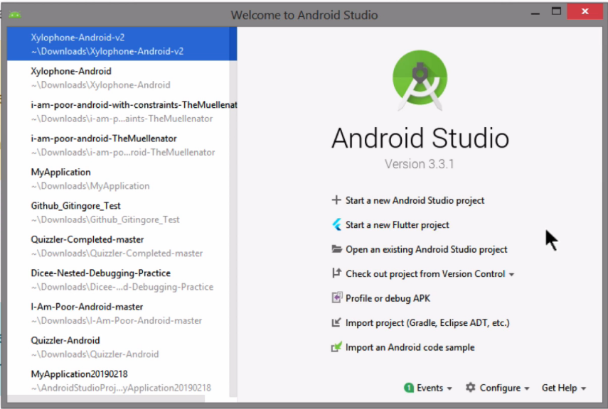

 
<h1>Estudo de Desenvolvimento   Flutter e Dart</h1>

The Complete Flutter Development BootCamp with Dart  
Officially created in collaboration with the Google Flutter team.

 
 
<h2>Módulo 2: Configurando o Ambiente de Desenvolvimento - Setup e Instalação</h2>

### Conteúdo
     
<a href="#aula01">Aula 01: Pré-requisitos para desenvolvimento Flutter</a> 
<a href="#aula02">Aula 02: Windows Setup - Instalando o Flutter SDK</a> 
<a href="#aula03">Aula 03: Windows Setup - Instalando o Android Stúdio</a> 

---

<h2>Aula 01: Pré-requisitos para Desenvolvimento Flutter </h2>

Antes de começarmos a instalar o Flutter, vamos primeiro ver o que você precisa para poder trabalhar com o Flutter e também executar seus aplicativos no iOS e Android.

Agora, com as primeiras coisas, você vai precisar de algum tipo de computador, para poder desenvolver para o Flutter, que pode ser Windows ou Mac.

Realmente não importa nesta fase. Para criar aplicativos Flutter, você pode fazê-lo em ambas as plataformas.

A próxima etapa para poder desenvolver aplicativos Flutter exige que tenhamos algum tipo de editor de código para poder criar o código Dart para que possamos construir aplicativos Flutter.

E, os dois contendores que você deve considerar são Android Studio e VS Code e ambos são bastante capazes em termos de desenvolvimento para Flutter.

Deixando de lado as preferências pessoais, usaremos o Android Studio para este curso. E há muitos motivos, incluindo que torna mais fácil trabalhar com o emulador, nos permite atualizar para o Android X ou Jetpack realmente facilmente e, no futuro, mesmo se você estiver usando o código VS, haverá lugares onde você precisa usar o Android Studio de qualquer maneira.

Portanto, podemos também nos comprometer com uma plataforma e aquela que escolhemos é o Android Studio.

Agora, se você tem preferência pelo VS Code, pode usá-lo para este curso, mas esteja ciente de que, quando estivermos usando certas ferramentas especializadas que foram desenvolvidas para o Android Studio, talvez você precise dar uma olhada rápida no Google e ver o que equivalente é para VS Code.

Agora, fora do código do Android Studio, IntelliJ e VS, eu não recomendaria usar nenhum outro tipo de editor de código. E é porque realmente precisamos de um IDE totalmente equipado para ser capaz de sugerir e sugerir código para nós, para ser capaz de fazer o preenchimento de código e para ser capaz de trabalhar perfeitamente com nossos emuladores, simuladores e rodando nossos aplicativos em dispositivos.

Agora, a próxima coisa é testar nossos aplicativos. Então, quando criamos um aplicativo Flutter, podemos construí-lo como um aplicativo Android ou como um aplicativo iOS. E como um usuário do Windows ou Mac, você achará incrivelmente fácil executar a versão Android do seu aplicativo Flutter. Tudo que você precisa é um dispositivo físico rodando Android ou um emulador, que vou mostrar em breve como fazer o download e como configurar, e essa é uma versão simulada de um telefone Android que será executado no seu computador e ambos funcionarão tão bem para os propósitos deste curso.

Por outro lado, se você quiser testar a versão iOS do seu aplicativo Flutter, as coisas ficam um pouco mais complicadas.

Agora, tradicionalmente, a Apple sempre foi muito sandbox.  Portanto, para desenvolver um aplicativo e executá-lo, seja em um dispositivo iPhone físico ou em um simulador iOS, você precisará de um Mac.

E esta é a parte que é muito difícil de contornar. A razão é que a Apple tem algo chamado Code Signing e isso é feito por razões de segurança, de forma que quando as pessoas baixam ou carregam um aplicativo para o iPhone, não há algo malicioso nelas. E cada aplicativo implantado em um dispositivo requer um certificado emitido pela Apple e, para emitir esse certificado, você precisará de algum tipo de Mac.

E quanto ao simulador, porque semelhante a um emulador de Android, também é apenas um programa de computador que roda no seu laptop ou desktop e simula um dispositivo iPhone real.

Agora, neste caso, você não o está carregando em um dispositivo físico, portanto, não precisará de um certificado para ele.

Mas o simulador iOS é um programa que só roda em um Mac. Então, basicamente, você descobrirá que para trabalhar com o aplicativo iOS para poder testá-lo, ser capaz de construí-lo e colocá-lo na App Store do iOS, você tornará sua vida infinitamente mais fácil simplesmente adquirindo um Mac de segunda mão, se você não tiver um, ou você pode apenas ter que pegá-lo emprestado de um amigo por alguns dias enquanto faz seus testes e enquanto carrega seu aplicativo na App Store. Porque na maior parte do tempo, faremos nosso desenvolvimento usando Flutter e isso é independente de plataforma, então podemos fazer isso no Windows ou no Mac e não importa. Mas é o teste na parte do iOS que é a parte complicada.

Agora o Flutter criou algumas ferramentas para tornar isso um pouco mais fácil. Por exemplo, aqui, você pode ver que estou executando um aplicativo no emulador Android à direita aqui e dentro do Flutter Inspector, há uma plataforma que alterna a renderização para alternar do Android para o iOS e você pode ver que esta barra superior mudanças na aparência para mostrar aproximadamente como seria se estivesse sendo executado no iOS.

E isso é ótimo enquanto você está testando e você não quer ter um simulador e um emulador ou um iPhone e um telefone Android executando o aplicativo ao mesmo tempo.

Portanto, este é um truque muito legal que você certamente achará útil se estiver trabalhando no Windows com um emulador de Android. Agora também há ferramentas como Codemagic, que permitem que você use integração contínua, construa, teste e entregue seus aplicativos Flutter direto para a App Store.

Mas, novamente, eu não recomendaria construir um aplicativo iOS sem nunca tê-lo testado em um dispositivo iOS real. Mesmo se você precisar pedir um emprestado ou um de segunda mão, vale a pena fazer isso apenas para garantir que você obtenha a melhor experiência do usuário e que tenha testado o aplicativo totalmente antes de colocá-lo na app store.

Então, como um resumo para desenvolver aplicativos Android com Flutter, você pode usar um Mac ou um PC. Você precisará baixar o Android Studio e um emulador de Android ou um dispositivo físico. Para construir aplicativos iOS com Flutter, recomendo que você tenha um Mac com o qual possa trabalhar.

E, novamente, usaremos o Android Studio e você precisará de um simulador iOS ou um dispositivo físico para poder testar seus aplicativos iOS.

Agora, nas próximas lições, mostraremos orientações passo a passo sobre como instalar o Flutter, instalar o Android Studio e configurar tudo para garantir que você esteja pronto para iniciar o desenvolvimento.

Então, quando estiver pronto, vá para a próxima lição e escolha sua faixa com base no sistema que você está executando, Mac ou PC.

---

<h2>Aula 03: Windows Setup - Instalando o Android Studio </h2>

Nesta lição, mostraremos como instalar e configurar o Android Studio para Flutter e Dart.

Portanto, se você já instalou o Android Studio, certifique-se de atualizar para a versão mais recente e acompanhar, pois mostraremos como adicionar os pacotes Flutter e Dart ao Android Studio.

Agora, se você não tem o Android Studio instalado, clique no link das instruções de 

instalação do Flutter na Documentação e clique em Baixar Android Studio. Depois de fazer o download, basta instalar o Android Studio em sua máquina Windows.

[Download Android Stúdio](https://developer.android.com/studio)

Agora, depois de instalar o Android Studio, certifique-se de passar pelo assistente de configuração do Android Studio.

Isso instala o SDK do Android mais recente, as ferramentas da plataforma do Android SDK e as ferramentas de construção do Android SDK que serão exigidas pelo Flutter ao construir seu aplicativo Android.

Agora é meio estranho que você baixe um software e depois tenha que baixar mais algumas coisas. Mas é assim que o Android Studio funciona e você começará a se acostumar com isso.

Mas assim que terminar, você poderá abrir o Android Studio e verá a tela de boas-vindas como esta. E você vai configurar e ir para as configurações, e vamos para a guia de plug-ins.

Agora, para instalar os plug-ins Flutter e Dart, você irá navegar pelos repositórios e procurar por Flutter. E deve ser aquele que tem apenas o nome Flutter e você vai seguir em frente e clicar em instalar. E certifique-se de aceitar qualquer pop-up que surgir. Agora, quando você instalar o plugin Flutter.

Ele também instalará o plug-in Dart junto. Então você pode ir em frente e clicar em sim para essa janela pop-up também. Agora, uma vez feito isso, você precisa reiniciar o Android Studio para que os efeitos ocorram. Portanto, certifique-se de clicar em reiniciar quando for solicitado a reiniciar o Android Studio e ativar as alterações em nossos plug-ins. E agora, uma vez feito isso, você verá um novo item de menu na tela de boas-vindas onde diz para iniciar um novo projeto Flutter.

Portanto, se você pode ver isso na tela de boas-vindas, considere esta lição um sucesso. Agora você está pronto para usar o Flutter e o Dart para desenvolver aplicativos do Flutter para Android.

<!-- Imagem de telas -->

Então, na próxima lição, vou mostrar como configurar o emulador Android e construir um novo projeto Flutter para executá-lo e testá-lo.

---

Freddy Krueger has nightmares about Chuck Norris. A bulletproof vest wears Chuck Norris for protection. Chuck Norris plays Jenga with Stonehenge. Chuck Norris once roundhouse kicked someone so hard that his foot broke the speed of light. Bigfoot claims he once saw Chuck Norris.

Chuck Norris doesn’t wear a watch. He decides what time it is. On New Year’s Eve, Chuck Norris promised that he’d lose 20 pounds. The next morning he shaved his chest and smiled as he realized that he’d lost 30. If you spell Chuck Norris in Scrabble, you win. Forever. Chuck Norris invented airplanes because he was tired of being the only person that could fly. Chuck Norris can speak Braille.

Some kids pee their name in the snow. Chuck Norris can pee his name into concrete. Chuck Norris once won an underwater breathing contest. With a fish. Chuck Norris can squeeze orange juice out of a lemon. Chuck Norris lost his virginity before his dad did. Chuck Norris once shattered the space-time continuum. He felt so bad, he put it back together.

---

//AU
// AU AU!